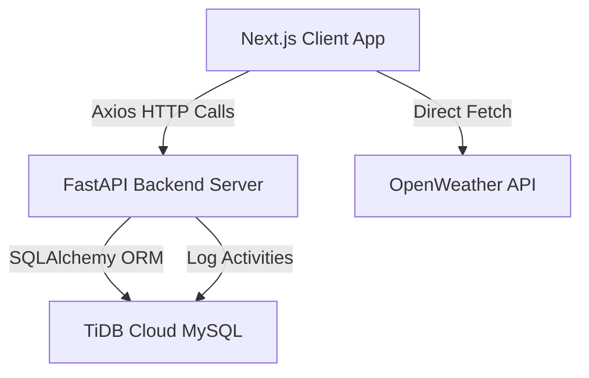

# Sampoorna Krishi (ಸಂಪೂರ್ಣ ಕೃಷಿ) — Project Documentation

Sampoorna Krishi is a modern digital ecosystem designed to empower farmers and rural cooperatives. It provides access to agricultural inputs, heavy machinery renting/leasing, peer-to-peer livestock trading, localized weather forecasting, and crop diagnosis, backed by an administrative control center.

---

## 🎯 1. Project Objective

The primary objective of Sampoorna Krishi is to digitize the agricultural value chain for Indian farmers by resolving systemic gaps in access, affordability, and language localization. In rural markets, farmers frequently face high commissions from intermediaries, a lack of transparency in renting heavy machinery, and difficulty finding reliable husbandry guidelines tailored to local conditions. 

Sampoorna Krishi solves these challenges by providing a direct peer-to-peer exchange for livestock trading, lowering equipment acquisition barriers through a subsidized leasing program, and offering translation-ready agronomy insights. Furthermore, it supplies cooperative administrators with a secure control center to maintain and moderate product and machinery directories, ensuring that listings remain up-to-date, accurate, and free of fraudulent postings.

---

## 💻 2. Tech Stack

### Frontend (Client-side)
*   **Next.js 15 (App Router, React 19)**: Chosen for its routing capabilities, server-side rendering, and performance optimizations. It enables fast initial loads while maintaining a dynamic experience for interactive modules.
*   **TypeScript**: Provides strict typing for complex objects such as vehicle specifications, livestock listings, and product categories, reducing runtime exceptions.
*   **TailwindCSS & Vanilla CSS**: Delivers a modern, responsive user interface utilizing curated dark/light thematic color palettes, glassmorphism headers, and polished layouts designed to work on both mobile devices and desktops.
*   **Framer Motion**: Powers transitions, floating comparison drawers, and interactive modal dialogs.
*   **Lucide React**: Supplies vector SVGs for all status indicators, category badges, and navigation.

### Backend (Server-side)
*   **FastAPI**: A high-performance Python framework utilizing asynchronous request handlers. It automatically generates OpenAPI documentation, facilitating integration with the frontend client.
*   **SQLAlchemy ORM**: Handles relational database queries and updates through object models, abstracting database dialects.
*   **PyMySQL**: A pure-Python MySQL client used to interface with the cloud database.
*   **TiDB Cloud MySQL**: A cloud-native, distributed SQL database. It provides horizontal scalability, MySQL-wire compatibility, and high availability, making it suitable for distributed cooperative data registries.

---

## ⚙️ 3. Architecture & Working



### Authentication & Sessions
The authentication flow utilizes JSON Web Tokens (JWT). When a user registers, their credentials are saved, and an activation OTP is simulated. Upon successful login, the FastAPI backend verifies the credentials and returns a signed JWT alongside user metadata (such as the admin role flag). The frontend client stores this token in local storage, and an Axios request interceptor automatically appends it as a Bearer token in the `Authorization` header for protected API requests.

### Client-side Feeds & State Synchronization
Static inventories (such as original machinery models and guides) are defined as React state arrays initialized from predefined models. This guarantees instant rendering and offline resiliency for basic lookup. When an administrator modifies or deletes a feed item, the frontend dispatches a mutation request to the backend database to log the change, updates local component states, and triggers toast notifications.

### Administrative Controls
The client application dynamically evaluates the user session for administrative privileges (`user.is_admin === true`). When active, the user interface exposes additional overlays, including edit modals and delete triggers on product cards, catalog listings, and livestock directories. Every administrative action (such as modifying prices or deleting catalog entries) calls the backend logging endpoint to store audit trails in the TiDB registry.

---

## 🌟 4. Core Features

### 🛒 A. Agri E-Commerce & Leasing (`/agri-ecommerce`)
A comprehensive marketplace where farmers can buy seeds, fertilizers, and traditional tools directly. It includes a built-in machinery renting/leasing module allowing farmers to select equipment, set booking dates, choose optional operator services, and view estimated lease costs under government-approved subsidized schemes. Admins can add products, modify pricing, or delete listings directly on the active feed.

### 🚜 B. Agricultural Vehicles Directory (`/agri-vehicles`)
Showcases detailed technical specifications (such as engine capacity, horsepower, gearbox systems, and price ranges) for compact, utility, and heavy-duty tractors, combine harvesters, tillers, and sprayers. A floating comparison drawer allows farmers to compare up to three vehicles side-by-side. Administrators can manage this directory by adding new vehicle listings or updating specifications using a dedicated interface.

### 🐄 C. Animal Husbandry & P2P Exchange (`/animal-husbandry`)
*   **Advisories**: Provides breeding, nutrition, and vaccination schedules for cattle, poultry, and sheep.
*   **Yield Projections**: Features a calculator that simulates monthly production output and estimated revenues based on feed quality, herd size, and healthcare ratings.
*   **Direct Marketplace**: Allows direct buying and selling of livestock to eliminate broker fees, complete with contact phone links. Administrators can edit listing details or remove posts.

### 💰 D. Crop Loans (`/crop-loans`)
Provides a directory of customized loan options designed for different crop varieties and agricultural needs. Farmers can explore interest rates, maximum loan tenures, and eligibility requirements. The module guides users through mock applications, facilitating access to capital for seeds, equipment, and irrigation setup.

### 📈 E. Market Prices (`/market-price`)
Tracks current market rates for various agricultural produce across regional mandis. It incorporates simple forecasting models to show trend directions, enabling farmers to make informed decisions about when and where to sell their crops to maximize profitability.

### 🌦️ F. Weather Advisory (`/weather-advisory`)
Retrieves real-time localized weather details (temperature, wind speeds, humidity, and atmospheric conditions) by calling the OpenWeather API. The system generates dynamic, color-coded farming recommendations—such as advising against chemical spraying during periods of high wind or rain—helping farmers protect their inputs.

### 🏛️ G. Government Schemes (`/schemes`)
A curated database of state and central government programs designed to benefit the agricultural community. Farmers can filter schemes by category (e.g., irrigation, organic farming, machinery) to view eligibility rules, application procedures, and direct benefit transfer details.

### 🩺 H. Crop Health Diagnosis (`/crop-diagnosis`)
An AI-powered diagnostic interface where farmers can upload or select images of damaged crops. The system evaluates visible symptoms to identify pests, leaf blights, or nutrient deficiencies, and suggests organic or chemical remedies to save the harvest.

### 💡 I. AI Farming Tips (`/farming-tips`)
Provides personalized, context-aware agricultural advice based on the farmer's specific crop choices and current cultivation stage. Tips cover soil preparation, planting, irrigation cycles, weeding, and post-harvest storage techniques.

### 🔍 J. Subsidy Finder (`/subsidy-finder`)
An intelligent search utility that helps farmers discover eligible subsidies for machinery purchases, high-yield seeds, micro-irrigation setups, and organic fertilizers. It simplifies finding cost-reduction opportunities.

### 🧪 K. AI Fertilizer Advisor (`/fertilizers`)
Evaluates crop types, field acreage, and soil characteristics to calculate exact NPK (Nitrogen, Phosphorus, Potassium) requirements. It advises on application timing, organic compost alternatives, and general fertilizer management practices.

### 🛡️ L. Crop Insurance (`/crop-insurance`)
Enables farmers to browse insurance packages and initiate crop damage assessment claims. The module features assessment forms to document field damage from droughts, excessive rainfall, or pests, facilitating speedier claim processing.

### 🌐 M. Multi-language Translation
Supports toggling between English, Hindi, and Kannada. The translation engine updates page text, labels, and local tips dynamically to match the user's regional language choice.

---

## 🔒 5. Administrative Setup

To initialize or promote a user to administrator status, execute the following script from the `backend` directory:

```bash
cd backend
.venv\Scripts\python.exe create_admin.py --email admin@sampoorna.com --password YourPasswordHere
```

This script connects directly to the TiDB MySQL database, creates the user account if it does not exist, and flags the `is_admin` attribute as true. This enables administrative capabilities across the frontend client.
